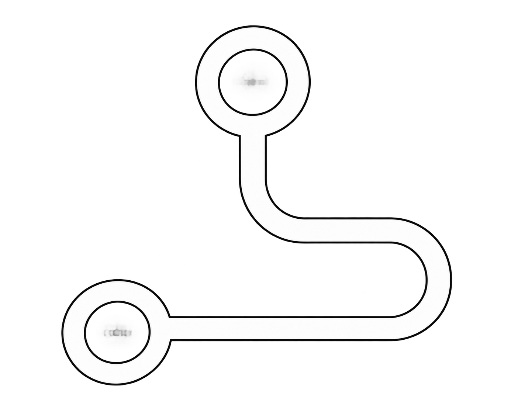
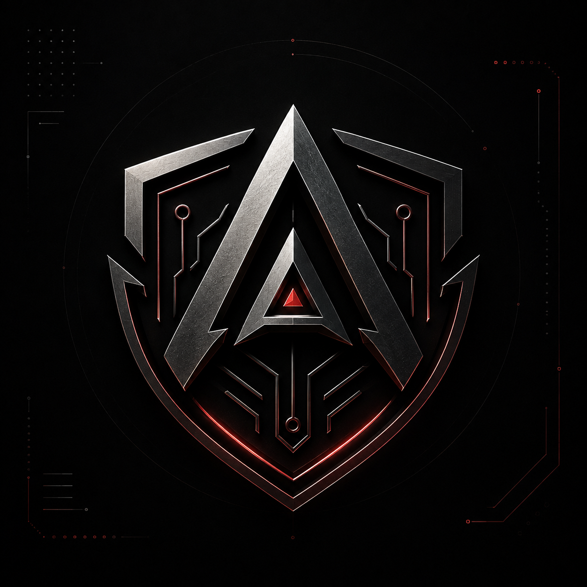

# Forex911

**Developer · AI Explorer · Builder**

Your friendly neighborhood developer  — moving between AI experiments, side projects, and the occasional late-night bug fix. No superpowers, just Python, React, and a genuine curiosity for solving problems. Hand me one, and I'll stick with it until it's done.

---

## 🕸️ Stack

**Languages**

**Frontend**

**Backend**

**AI / ML**

**Database**

**DevOps**

**Tools**

**Specializations**

---

## 🏆 Hall of Fame

Things I've built

 

  <table>
    <tr>
      <td align="center" width="160">
        <a href="https://placify.forex911.online">
          
            
          <b>Placify</b>
        </a>
      </td>
      <td align="center" width="160">
        <a href="https://flow.forex911.online">
          
            
          <b>F9 Flow</b>
        </a>
      </td>
      <td align="center" width="160">
        <a href="https://pindrop.forex911.online">
          
            
          <b>PinDrop</b>
        </a>
      </td>
      <td align="center" width="160">
        <a href="https://github.com/forex911/NeuraDepth">
          
            
          <b>NeuraDepth</b>
        </a>
      </td>
      <td align="center" width="160">
        <a href="https://acros.forex911.online">
          
            
          <b>Acros</b>
        </a>
      </td>
      <td align="center" width="160">
        <a href="https://dany.forex911.online">
          
            
          <b>Dany</b>
        </a>
      </td>
    </tr>
  </table>

 

  <a href="https://github.com/forex911?tab=repositories">
    View all projects →
  </a>

---

## 🕸️ Projects

### 🤖 AI / Machine Learning

| Project | Description | Repository | Live Demo |
| --- | --- | --- | --- |
| **ACROS** | AI-assisted malware analysis with sandbox orchestration and threat intelligence. |  |  |
| **Character Recognition** | Handwritten character recognition using deep learning and FastAPI. |  |  |
| **NeuraDepth** | Computer vision depth estimation and 3D reconstruction. |  | ) |
| **Traitor Tracker** | AI-powered image-origin detection and suspicious-activity web app. |  |  |
| **Gold Price Prediction** | Machine learning model for gold price forecasting. |  |  |
| **SuperX** | AI image enhancement and upscaling using PyTorch, ONNX and Flask. |  | — |
| **Diabetes Type Classifier** | ML classification model for diabetes type prediction. |  | — |

| **Learning Behavior Analysis** | ML-driven analysis of online learning behavior patterns. |  | — |

### 🧩 Browser Extensions

| Project | Description | Repository | Live Demo |
| --- | --- | --- | --- |
| **F9 Flow** | Chrome/Firefox extension that turns long AI conversations into a clean navigable timeline. |  |  |
| **PinDrop** | Chrome extension for instant Pinterest-to-clipboard workflow with Figma and Photoshop. |  |  |

### 🖥️ Desktop Applications

| Project | Description | Repository | Live Demo |
| --- | --- | --- | --- |
| **Dany Downloader** | Windows media downloader built with Electron, Python, yt-dlp and FFmpeg supporting 4K/8K. |  |  |

### 🌐 Full-Stack Web Applications

| Project | Description | Repository | Live Demo |
| --- | --- | --- | --- |
| **DrawingSpot** | Art commission marketplace built with Spring Boot, React and PostgreSQL. |  |  |
| **Placify** | Placement prep platform with aptitude tests, coding practice and progress tracking. |  |  |
| **F9 Gallery** | React media gallery with masonry layouts and lazy loading for large collections. |  |  |
| **AI Codebase Analyzer** | Scans repos to detect duplication, analyze complexity and generate refactoring suggestions. |  |  |
| **Preset Generator** | AI-powered Lightroom preset generator from natural language prompts. |  |  |

### ⚡ CLI / Developer Tools

| Project | Description | Repository | Live Demo |
| --- | --- | --- | --- |
| **Paste2Project** | CLI tool that converts a pasted folder tree into real files and directories instantly. |  |  |
| **Mooper** | Python CLI media converter and transcoder built with PyAV. |  | )  |

### 🧠 Experimental

| Project | Description | Repository |
| --- | --- | --- |
| **SAGE** | Experimental Python project. |  |

---

## 🕸️ Currently Exploring

- Artificial Intelligence
- Agentic AI
- Developer Tooling
- Computer Vision
- Cloud Infrastructure
- Open Source

---

## 🕸️ Contact

- **Portfolio:** 

- **GitHub:** 

- **Docker Hub:** 

- **LinkedIn:** 

- **Instagram:** 

- **Email:** 

 

🕷️ ⎯⎯⎯⎯⎯⎯⎯⎯⎯⎯⎯⎯⎯⎯⎯⎯⎯⎯⎯⎯⎯⎯⎯⎯⎯⎯⎯⎯⎯⎯⎯⎯⎯⎯⎯⎯⎯⎯⎯⎯⎯⎯⎯⎯⎯⎯⎯⎯⎯⎯⎯⎯⎯⎯⎯⎯⎯⎯⎯⎯⎯⎯⎯⎯ 🕸️

**Thanks for stopping by!**

